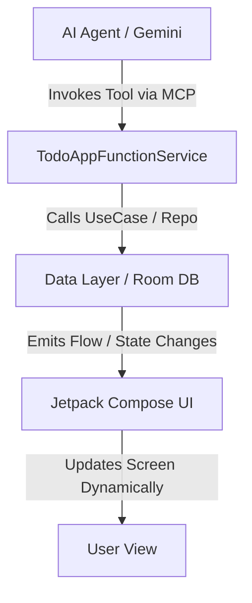

# 🤖 NexusAI - AI-Ready Android Ecosystem (AppFunctions Showcase)

[](https://android.com)
[](https://kotlinlang.org)
[](https://android.com)

**NexusAI** एक कटिंग-एज (Cutting-edge) एंड्रॉइड प्रोजेक्ट है जो **Google I/O '26** में पेश किए गए नए **AppFunctions API** और **Model Context Protocol (MCP)** को शोकेस करता है। यह ऐप दिखाता है कि कैसे ट्रेडिशनल एंड्रॉइड ऐप्स को बैकग्राउंड-एक्जीक्यूटेबल "AI Skills" में बदला जा सकता है, जिससे AI एजेंट्स (जैसे Gemini) बिना ऐप खोले यूजर के लिए काम कर सकें।

यह प्रोजेक्ट पूरी तरह से **Jetpack Compose**, **Clean Architecture**, और **On-Device AI Workflows** पर आधारित है।

---

## 🚀 Key Features (AI-Powered Use Cases)

1. **Smart Expense Tracker (Zero-Click Entry)**
   * **AI Capability:** यूजर AI से बोलेगा: *"मैंने कॉफी पर ₹150 खर्च किए।"*
   * **AppFunction Logic:** बैकग्राउंड में ऐप अमाउंट और केटेगरी पार्स करके सीधे Local Room Database में सेव कर देता है।

2. **Contextual Task Manager**
   * **AI Capability:** *"कल सुबह 9 बजे की मीटिंग का टास्क ऐड कर दो।"*
   * **AppFunction Logic:** बिना ऐप ओपन किए टास्क शेड्यूलर और डेटाबेस को रीयल-टाइम में अपडेट करता है।

3. **Secure Wallet Transactions (PendingIntent Intercepts)**
   * **AI Capability:** *"राहुल को ₹500 ट्रांसफर करो।"*
   * **Security Logic:** हाई-स्टेक्स एक्शन्स के लिए ऐप डायरेक्ट पैसे नहीं काटता। AppFunction एक `PendingIntent` रिटर्न करता है जो **Jetpack Compose बायोमेट्रिक प्रॉम्ट** खोलता है। यूजर की फिंगरप्रिंट ऑथेंटिकेशन के बाद ही ट्रांजैक्शन पूरा होता है।

---

## 🏗️ Architecture & Data Flow

यह ऐप **MVI (Model-View-Intent)** पैटर्न और **Multi-Module Clean Architecture** का पालन करता है। AI एजेंट कभी भी सीधे UI को टच नहीं करता; यह सीधे Data Layer से बात करता है, और Compose UI रिएक्टिव स्टेट्स (StateFlow) के ज़रिए खुद को रीयल-टाइम में अपडेट करता है।



### Module Structure
* `:core:database` - Room DB, Entities, and Daos.
* `:core:model` - Domain data structures shared across layers.
* `:data:repository` - Business logic and data source orchestration.
* `:feature:appfunctions` - Contains `@AppFunction` entry points and AI schemas.
* `:feature:ui` - Fully-reactive Jetpack Compose screens, ViewModels, and Design System.

---

## 🛠️ Tech Stack & Libraries

* **Language:** Kotlin (with KSP for AppFunctions code generation)
* **UI Framework:** Jetpack Compose (Material 3)
* **AI Architecture:** Android AppFunctions (Experimental Preview '26), Android AICore
* **Dependency Injection:** Hilt
* **Local Storage:** Room Database
* **Asynchronous Flow:** Kotlin Coroutines & Channels / StateFlow

---

## 💻 Code Snippet: Declaring an AppFunction

गूगल के नए नियमों के अनुसार, फंक्शन के ऊपर लिखे गए **KDoc (कमेंट्स)** को ही AI एजेंट (जैसे Gemini) पढ़कर समझता है कि उसे इस टूल को कब और क्यों चलाना है:

```kotlin
@AppFunctionServiceEntryPoint
class ExpenseAppFunctionService : AppFunctionService() {
    
    /**
     * यूजर के खर्चों को उनके वॉलेट से ट्रैक और सेव करता है।
     * @param amount खर्च की गई राशि (रुपए में)
     * @param category खर्च की श्रेणी (उदा. Food, Travel, Bills)
     */
    @AppFunction
    suspend fun addExpenseRecord(amount: Double, category: String): String {
        // Repository के ज़रिए DB में डेटा इन्सर्ट करना
        expenseRepository.insert(Expense(amount = amount, category = category))
        
        // Jetpack Compose UI को सूचित करने के लिए रीयल-टाइम फीडबैक
        return "₹amount का खर्चा 'category' केटेगरी में जोड़ दिया गया है!"
    }
}
```

---

## 🛠️ How to Run & Test This Project

1. **Prerequisites:**
   * Android Studio Jellyfish (या उससे लेटेस्ट वर्शन)
   * Android SDK 35+
   * `Gemini Nano / AICore Developer Preview` इनेबल्ड डिवाइस या एमुलेटर।

2. **Steps:**
   * प्रोजेक्ट को क्लोन करें: `git clone https://github.com`
   * प्रोजेक्ट को एंड्रॉइड स्टूडियो में सिंक करें।
   * **AppFunctions Viewer** (Android Tooling) का उपयोग करके बैकग्राउंड टूल-कॉलिंग को टेस्ट करें।

---

## 🤝 Contributing & License

अगर आपके पास कोई नया AI-Use Case या सुझाव है, तो बेझिझक Pull Request ओपन करें। यह प्रोजेक्ट **MIT License** के तहत उपलब्ध है।
